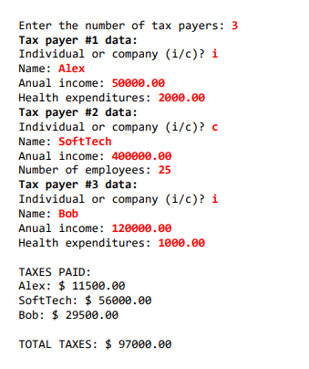

# Total Taxes

Projeto feito no curso [Java COMPLETO 2023 Programação Orientada a Objetos +Projetos](https://www.udemy.com/course/java-curso-completo/) do professor Nélio Alves.

Mais um exercício pra mostrar a minha evolução em POO.
Fiz esse exercício sem usar o modelo UML, por sugestão do professor.

# 📃 Idéia do projeto

Ler os dados de N contribuintes, podendo ser tanto pessoa física quanto jurídica, e mostrar o valor do imposto pago por cada um, assim como o total de imposto arrecadado. Exemplo:

